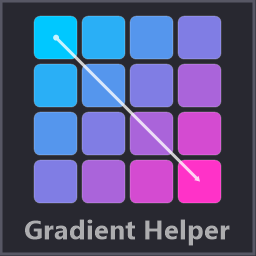
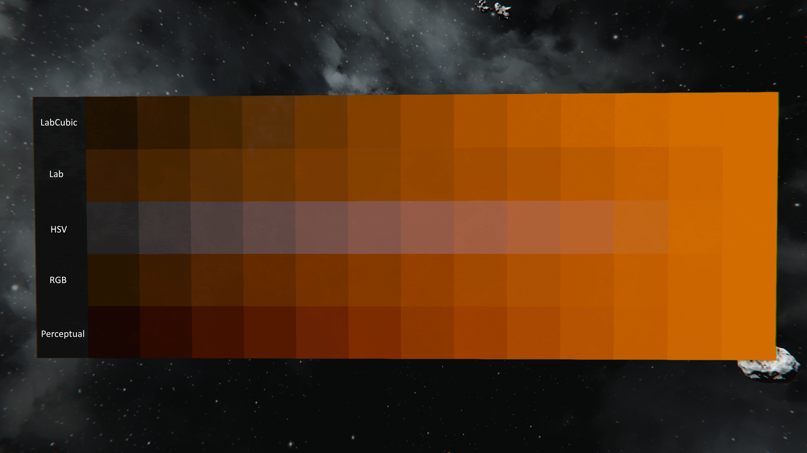

  

# GradientHelper

A Space Engineers plugin that lets you paint color gradients across blocks on a grid. Supports both linear and radial gradient modes.

## Usage

1. Pre-paint two blocks with the colors you want for the gradient start and end
2. Press **Ctrl+G** to enter linear gradient mode (or **Ctrl+R** for radial)
3. Paint action on the first block to set the **start** position and color
4. Paint action on a second block to set the **end** position and color
5. Paint any blocks on the grid — each block receives a gradient-interpolated color based on its position between start and end
6. Newly placed blocks on the grid are also auto-colored to match the gradient
7. Press the hotkey again to exit gradient mode

Colors are read from the existing color of each picked block. Moving too far from the grid automatically resets gradient mode.

## Apply Skin

When enabled (**Ctrl+K** to toggle), painting with the gradient also applies the currently selected skin to each block.

## Interpolation Modes

Cycle through interpolation modes with **Ctrl+T**:

- **RGB** — Linear interpolation in sRGB space (default)
- **HSV** — Linear interpolation in HSV space
- **Lab** — Interpolation in CIE L\*a\*b\* perceptual color space
- **CubicLab** — Lab interpolation with smoothstep easing
- **Perceptual** — Brightness-matched interpolation using gamma 0.43

## Hotkeys

| Default Hotkey | Action |
|---|---|
| **Ctrl+G** | Toggle linear gradient mode |
| **Ctrl+R** | Toggle radial gradient mode |
| **Ctrl+T** | Cycle interpolation mode |
| **Ctrl+K** | Toggle apply skin |
| Unbound | Toggle debug drawing |

All hotkeys are suppressed while a GUI screen or chat is open. Configure hotkeys and settings in the plugin settings dialog.
